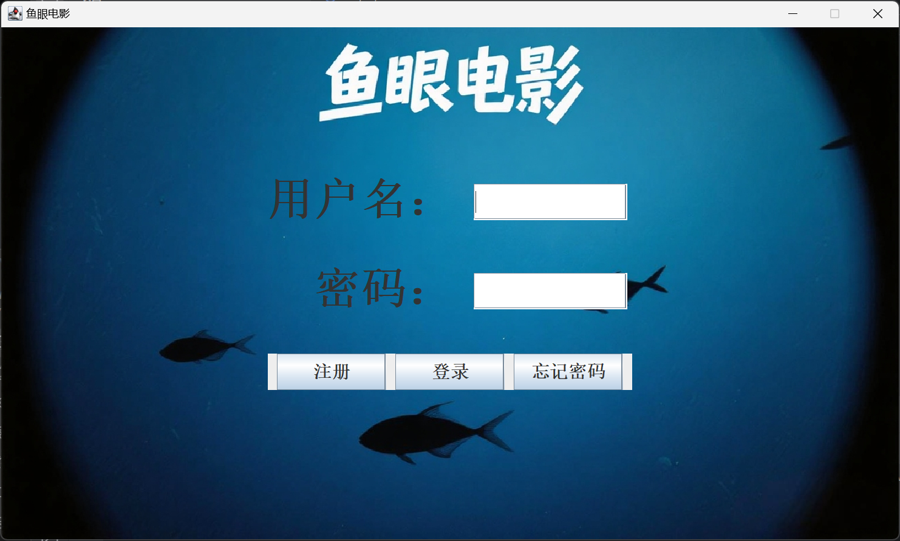
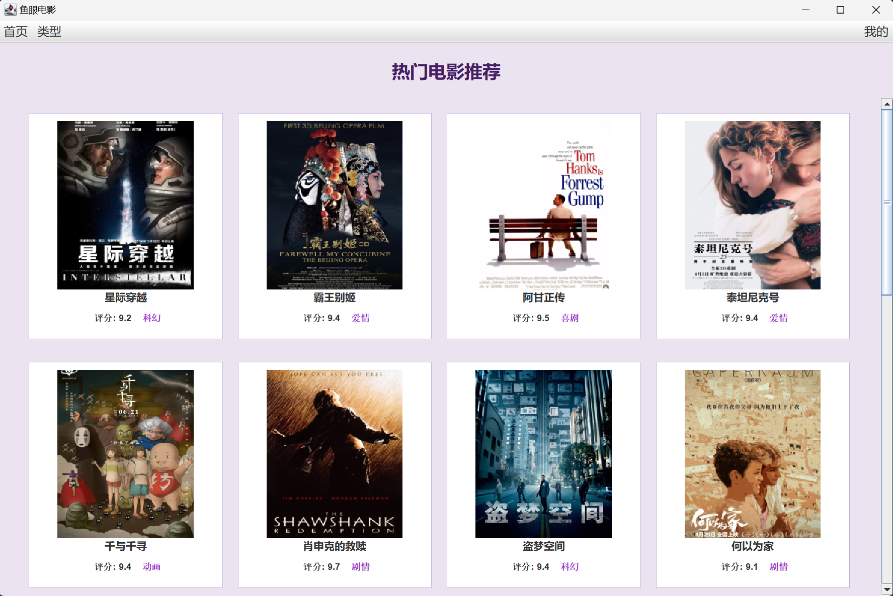
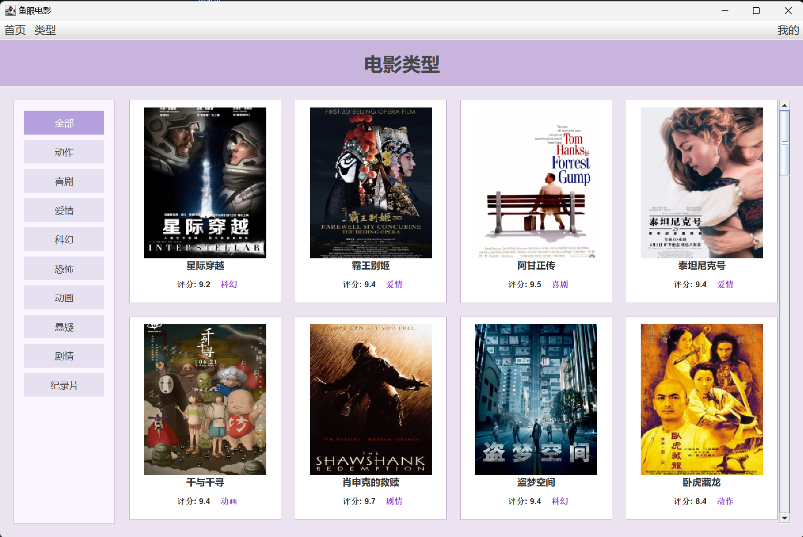
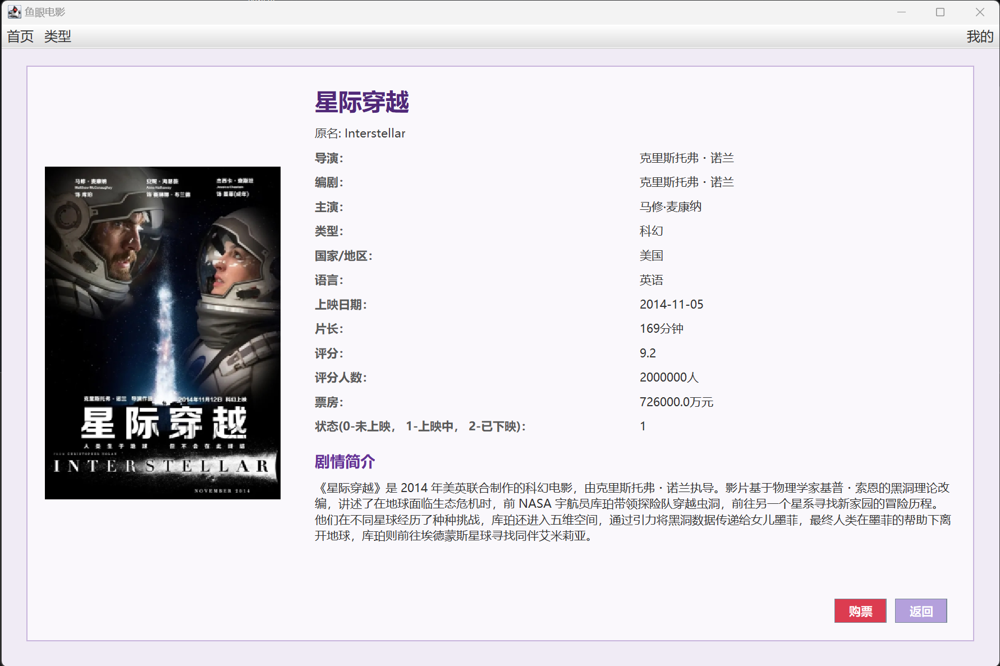
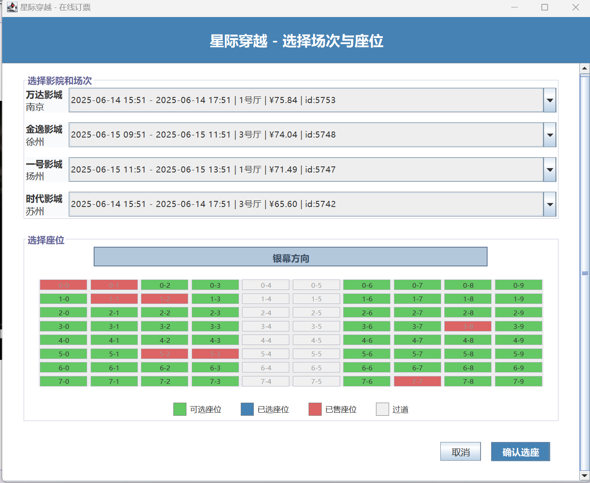
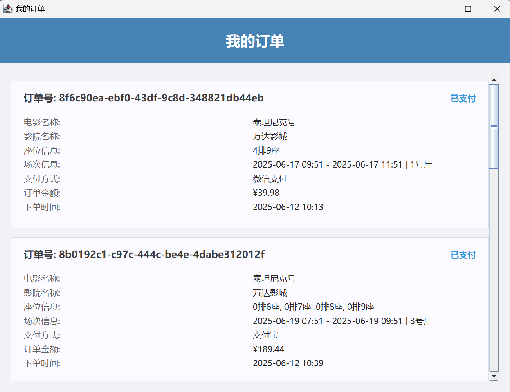
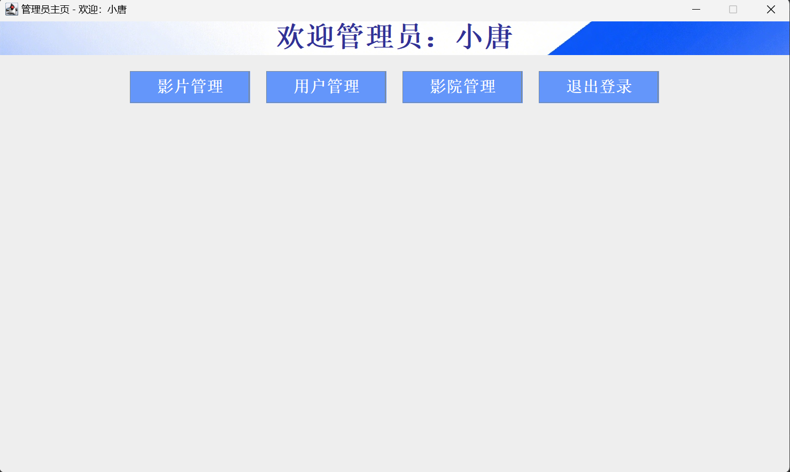
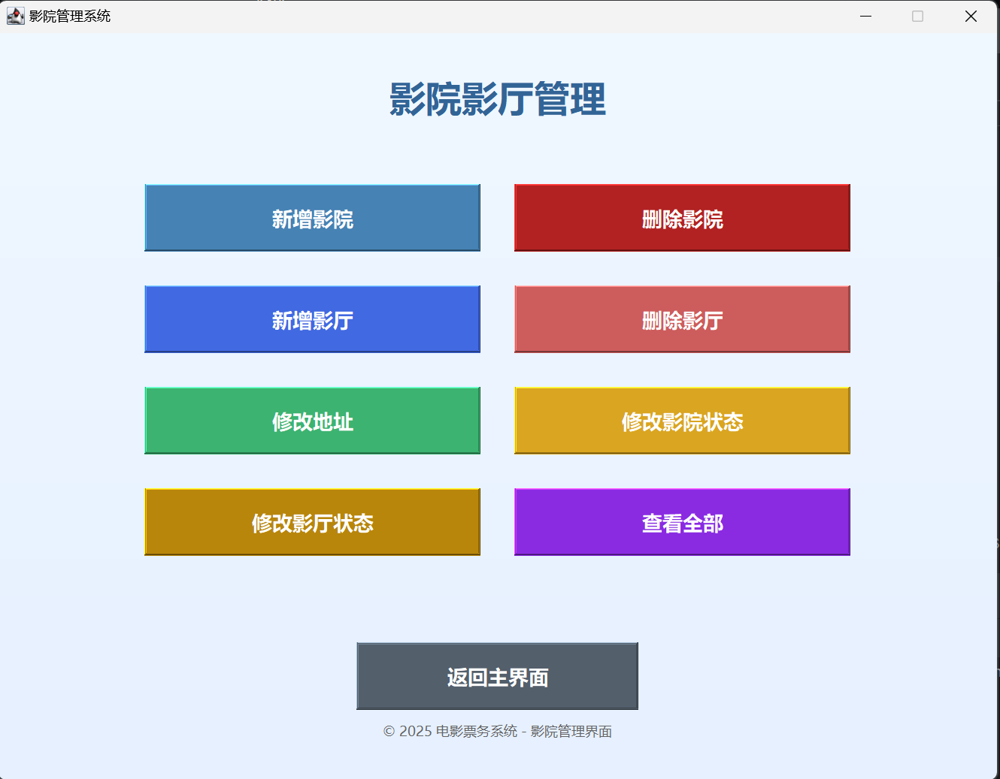
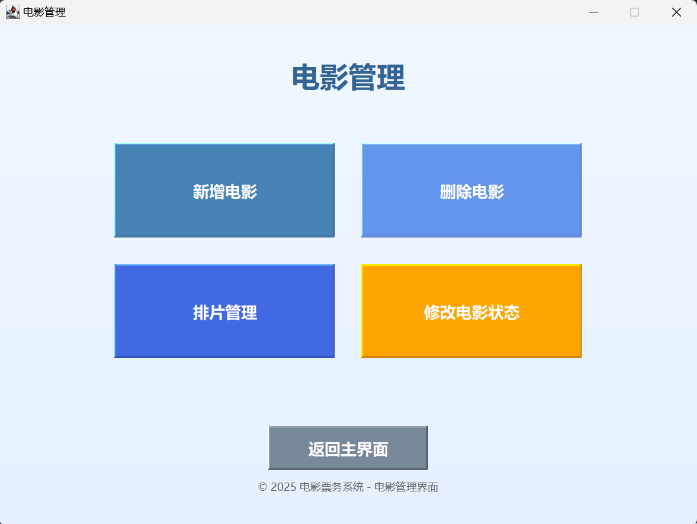

<p align="center">
  
  
  
  
  
  
</p>

<h1 align="center">FishEye Movie</h1>

<p align="center">
  A desktop <strong>cinema ticket-booking & management system</strong> built with <strong>Java Swing + JDBC + MySQL</strong>.
</p>

<p align="center">
  <a href="#installation">Installation</a> ·
  <a href="#what-is-it">What is it?</a> ·
  <a href="#features">Features</a> ·
  <a href="#tech-stack">Tech Stack</a> ·
  <a href="#project-structure">Project Structure</a> ·
  <a href="#screenshots">Screenshots</a> ·
  <a href="#database">Database</a> ·
  <a href="#default-accounts">Default Accounts</a> ·
  <a href="#notes">Notes</a>
</p>

<p align="center">
  <a href="README.md"><strong>English</strong></a> · <a href="README.zh-CN.md">简体中文</a>
</p>

---

## 🚀 Installation

### Prerequisites
- **JDK 8 or newer**
- **MySQL 8.0 or newer** (the dump uses `utf8mb4_0900_ai_ci`, so MySQL 8.0.4+ is required)
- **MySQL Connector/J 8.0.24** jar ([download](https://repo1.maven.org/maven2/mysql/mysql-connector-java/8.0.24/mysql-connector-java-8.0.24.jar))
- A graphical environment (Swing desktop app)

### Steps

**1. Get the code**
```bash
git clone https://github.com/Je-taimais/Java-cinema-ticket-system.git
cd Java-cinema-ticket-system
```

**2. Prepare the database**

> ⚠️ The SQL file has **no** `CREATE DATABASE`/`USE`. First create a database literally named **`电影院`**, then import.

```sql
CREATE DATABASE `电影院` CHARACTER SET utf8mb4 COLLATE utf8mb4_0900_ai_ci;
USE `电影院`;
SOURCE database/cinema.sql;
```

**3. Configure the database connection**

Edit `src/cn/jbit/mbs/dao/JDBCUtil.java`:

```java
private static String url = "jdbc:mysql://localhost:3306/电影院";
private static String name = "root";
private static String password = "root";
```

Change these to match your own MySQL username / password / database name if different.

**4. Add the JDBC driver**

Put the downloaded jar into `lib/`:
```
lib/mysql-connector-java-8.0.24.jar
```

**5. Compile** (run from project root)
```bash
javac -cp "lib/mysql-connector-java-8.0.24.jar" -d out $(find src -name "*.java")
```

> With IntelliJ IDEA: open the folder, add the jar to Libraries, and run `cn.jbit.mbs.view.Login`.

**6. Run** (must run from project root so `picture/` resources load)
```bash
# Windows
java -cp "out;lib/mysql-connector-java-8.0.24.jar" cn.jbit.mbs.view.Login

# Linux / macOS
java -cp "out:lib/mysql-connector-java-8.0.24.jar" cn.jbit.mbs.view.Login
```

---

## 🎬 What is it?

FishEye Movie is a comprehensive desktop management system for cinemas. It serves two roles:

- **Moviegoers** can browse films, view details, pick seats by session, pay online, and manage their own orders through a GUI.
- **Cinema administrators** can maintain movies, cinemas, halls, scheduling plans, and user accounts from a backend console.

The project follows a classic layered architecture (`view` + `dao` + `entity`), connects to MySQL directly via JDBC, and builds its UI with hand-coded Swing — no web server or third-party framework required, so it runs locally out of the box.

---

## 🎯 Problem It Solves

Traditional cinema ticketing relies on manual counter operations, which leads to messy scheduling, opaque seat availability, and hard-to-track statistics. This project unifies "audience ticketing" and "cinema operations" into one desktop program:

- **For audiences:** a one-stop experience of browsing, session selection, seat-map picking, ordering, and payment (simulated Alipay / WeChat Pay).
- **For administrators:** a visual backend for movie on/off-lining, cinema & hall management, scheduling, and user management — lowering the operations barrier.
- **For developers:** a clean, readable Swing + JDBC example suitable for coursework / learning.

---

## ✨ Features

### Audience
- Register, login, password recovery
- Home page recommendations & browsing
- Filter movies by genre (Action / Sci-Fi / Drama …)
- Movie detail (director, cast, synopsis, rating, box office)
- Session selection + seat-map picking
- Order placement & simulated payment (Alipay / WeChat Pay)
- My orders (view, refund)

### Administrator (`user_type = 2`)
- Movie management: add, delete, update movie status (Not Released / Now Showing / Ended)
- Cinema & hall management
- Scheduling management (arrange sessions, halls, pricing)
- User management (view, blacklist, enable/disable)

---

## 🧱 Tech Stack

| Layer | Technology |
| --- | --- |
| Language | Java 8+ (Swing) |
| UI | Java Swing (hand-coded, no GUI builder) |
| Data Access | JDBC (raw `PreparedStatement`) |
| Database | MySQL 8.0+ (dump from MySQL 9.2, uses `utf8mb4_0900_ai_ci`) |
| Driver | MySQL Connector/J **8.0.24** |
| Architecture | Three-tier: `view` / `dao` / `entity` |

---

## 📂 Project Structure

```
cinema/
├── src/cn/jbit/mbs/
│   ├── view/          # Swing UI layer (login, home, detail, booking, admin...)
│   ├── dao/           # Data access interfaces & JDBC utility (JDBCUtil)
│   ├── dao/impl/      # DAO implementations (movie/cinema/order/screening/user)
│   └── entity/        # Entity classes (Movie, Cinema, Hall, Screening, Order, User...)
├── picture/           # Posters / backgrounds / payment QR codes (~43MB)
├── screenshots/       # Project screenshots used in this README
├── database/
│   └── cinema.sql     # Database script (schema & sample data)
├── cinema.iml         # IntelliJ module file
└── .gitignore
```

---

## 🖼️ Screenshots

### Login


### Home


### Movie Categories


### Movie Detail


### Ticket Booking


### My Orders


### Admin Dashboard


### Cinema Management


### Movie Management


---

## 🗄️ Database

The database contains 7 tables:

| Table | Description |
| --- | --- |
| `user` | Users (`user_type=0/1` for regular users, `=2` for admins, `=-1` banned) |
| `cinema` | Cinemas (name, address, business status) |
| `hall` | Halls (belong to a cinema, name, status) |
| `movie` | Movies (title, director, genre, rating, box office, status, poster...) |
| `screening` | Screenings (movie, hall, start/end time, price, status) |
| `order` | Orders (order number, user, screening, amount, payment method, status) |
| `order_seat` | Order-seat relationship |

---

## 🔑 Default Accounts

> Passwords are stored in plaintext (for learning / coursework only — do not use in production).

| Role | Username | Password | Note |
| --- | --- | --- | --- |
| Admin | `小唐` | `123456` | `user_type = 2` |
| Admin | `小三` | `123456` | `user_type = 2` |
| User | `小王` | `123456` | `user_type = 1` |
| Banned | (demo `user_type = -1`) | — | Login will be rejected |

---

## ⚠️ Notes

- **The DB name is Chinese `电影院`**: keep it exactly identical in both the `CREATE DATABASE` and the JDBC URL.
- **Default credentials**: `JDBCUtil` hardcodes `root / root`; change it for any real deployment.
- **`picture/` resources**: the ~43MB folder (posters / backgrounds / QR codes) is committed so the UI is complete; run from the project root.
- **Payments are simulated**: Alipay / WeChat Pay is simulated and does not charge real money.

---

## 📄 License

This project is released under the [MIT License](LICENSE). You are free to use, copy, modify, and redistribute it, provided the copyright notice and permission notice are included.

---

Made with Java Swing & JDBC · FishEye Movie · [简体中文](README.zh-CN.md)
